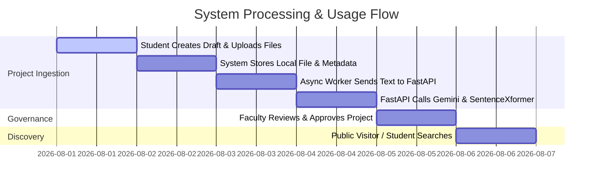

# Software Requirements Specification (SRS)
## ProjectVault — AI-Powered Academic Project Repository

**Document Version:** 1.1.0  
**Date:** August 2026  
**Status:** Revised for Implementation

---

## 1. Complete Problem Statement
In educational institutions, student capstone, research, and semester projects represent significant intellectual property. Currently, these projects suffer from critical organizational bottlenecks:
* **Siloed & Forgotten Artifacts:** Code, project reports (PDF), presentations (PPTX), and documentation are scattered across local drives, emails, or physical submissions, causing valuable academic work to be lost over time.
* **Project Duplication Across Academic Batches:** Students frequently recreate projects that were already developed by previous batches because past project information is unorganized, unindexed, or difficult to search.
* **Inefficient Keyword Search:** Traditional search relies strictly on exact title or tag matches, missing conceptual, structural, and domain-level overlaps.
* **Manual Metadata & Review Workloads:** Faculty members spend excessive time classifying projects, checking domain alignment, and manually organizing submissions.
* **Lack of Role-Based Governance:** Academic artifacts lack central audit trails, state transition enforcement (Draft, Submitted, Under Review, Approved), and structured public access.

**ProjectVault** solves these issues by serving as an **AI-powered centralized academic project repository** that preserves previous students' projects and helps future students discover existing work, avoid accidental project duplication, find related projects, and develop new or enhanced project ideas based on existing academic work.

### The Intended Knowledge Cycle
```
Previous Final-Year Students
         │
         ▼ (Upload completed projects)
ProjectVault Repository
         │
         ▼ (Search, discover, & analyze past work)
Future Students (Avoid duplication / gain inspiration)
         │
         ▼ (Develop new or enhanced projects via normal Faculty interaction)
Completed Projects Uploaded Back
         │
         ▼ (Repository grows continuously over time)
Centralized Institutional Knowledge Base
```

> [!NOTE]
> ProjectVault does **NOT** introduce a separate "Project Proposal" or "Enhancement Approval" workflow module. If a student chooses to enhance an existing project, that process is handled through normal academic interactions between the student and their faculty guide. ProjectVault acts as the central intelligence and discovery repository.

---

## 2. Project Objectives
* **Centralize & Preserve Intellectual Property:** Store and organize academic projects, documents, team members, and departments in a unified repository.
* **Discover & Prevent Accidental Duplication:** Empower students to discover past projects via multi-criteria keyword search, AI metadata analysis, and vector similarity search.
* **Automate AI Ingestion:** Automatically extract document text, generate summaries, classify domains, detect tech stacks, and extract problem statements using the **Google Gemini API** (via an asynchronous Python FastAPI service).
* **High-Performance Semantic Embeddings:** Generate dense 384-dimensional vector embeddings using SentenceTransformers (`all-MiniLM-L6-v2`) and index them in PostgreSQL using `pgvector`.
* **Semantic Recommendations:** Deliver instantaneous recommendations for related projects based on embedding cosine similarity scores to help students explore related research.
* **Enforce Governed RBAC & Visibility:** Implement strict authenticated role-based access (`ADMIN`, `FACULTY`, `STUDENT`) alongside unauthenticated `PUBLIC VISITOR` access, enforced by clear project visibility rules (`PUBLIC`, `PRIVATE`, `DEPARTMENT_ONLY`).
* **Student-to-Alumni Identity Continuity:** Ensure graduation updates a user's status to `ALUMNI` without creating duplicate accounts, preserving historical project authorship under a single user identity.
* **Production-Grade Intranet Architecture:** Decouple business logic (Spring Boot) from AI inference (FastAPI) and storage, allowing deployment on college LAN/Wi-Fi with controlled outbound access to external AI services.

---

## 3. System Scope & Scale
* **Institutional Context:** Designed for academic departments, universities, and technical colleges (MCA / B.Tech / M.Tech / PhD repositories).
* **Initial Development Dataset:** Architected and tested initially on a dataset of **approximately 30 sample projects**, with an explicit design target to scale seamlessly to a department's full repository of **300+ real projects**. (Vector indexing is designed to support up to 50,000+ vectors for long-term institutional expansion).
* **Multi-Format Ingestion:** Extracts raw text from PDF, DOCX, and PPTX project artifacts.
* **Asynchronous Ingestion:** Non-blocking file upload flow with background worker AI processing.
* **Configurable Storage Architecture:** Uses local filesystem storage by default (`storage/projects/project-xxx/`), with PostgreSQL storing strictly file metadata and storage paths. Designed with storage abstractions to easily swap local storage for college server/NAS, MinIO, or AWS S3 in the future without changing database schemas.

---

## 4. User Roles, Access Model & Graduation Lifecycle

### 4.1 RBAC vs. Project Visibility Architecture
ProjectVault strictly separates **User Roles (RBAC)** from **Project Visibility**:
* **User Role (RBAC):** Controls what an authenticated user is permitted to *do* (e.g., create project, review submission, manage users).
* **Project Visibility:** Controls who is allowed to *view* a specific project (`PUBLIC`, `PRIVATE`, `DEPARTMENT_ONLY`).

```
                PROJECTVAULT ACCESS MODEL
                            │
        ┌───────────────────┴───────────────────┐
        │                                       │
  PUBLIC VISITOR                          AUTHENTICATED
(Unauthenticated)                               │
No Account Required                 ┌───────────┼───────────┐
Can view PUBLIC/APPROVED            │           │           │
        projects                 STUDENT     FACULTY      ADMIN
                                    │
                               Graduation
                                    │
                                    ▼
                                 ALUMNI
                          (Same user identity,
                            updated status)
```

### 4.2 Detailed Access Matrix

| Role / Context | Authentication | Permissions & Scope |
| :--- | :--- | :--- |
| **PUBLIC VISITOR** | Unauthenticated | Browse and search `APPROVED` projects marked as `PUBLIC`. Read project summaries, view metadata, and download public attachments when permitted. Cannot create, edit, review, or manage any system resources. |
| **STUDENT** | Authenticated (JWT) | Create projects in `DRAFT`, upload project files, manage team members, select faculty guide, submit projects for review (`SUBMITTED`), edit own projects (when in `DRAFT`/`REJECTED`), use semantic search, view recommendations. |
| **ALUMNI** | Authenticated (JWT) | Graduation status transition of a `STUDENT`. Retains login identity and historical authorship of past projects. Can browse repository and view own past projects. |
| **FACULTY** | Authenticated (JWT) | Access department projects, serve as project guide, review `SUBMITTED` projects, approve/reject submissions with feedback, trigger AI re-indexing, view department analytics. |
| **ADMIN** | Authenticated (JWT) | Full system administration. Manage departments, user accounts, role assignments, user statuses, system parameters, audit logs, and override project states. |

### 4.3 Student → Alumni Identity Rule
A student account represents the physical person, not a temporary academic session. Upon graduation:
1. The user account status updates from `ACTIVE` (Student) to `ALUMNI`.
2. **No new or duplicate user account is created.**
3. All historical projects, co-authorships, and uploaded artifacts remain permanently associated with the original user identity.

---

## 5. Functional Requirements (FRs)

### 5.1 Authentication & User Management
* **FR-AUTH-01:** System shall allow user registration with department association and default role (`STUDENT`) and status (`ACTIVE`).
* **FR-AUTH-02:** System shall authenticate users via JWT (JSON Web Tokens) with configurable expiration and secure BCrypt password hashing.
* **FR-AUTH-03:** System shall provide a `/me` endpoint returning authenticated user context (id, email, role, status, department).
* **FR-USER-01:** System shall support unauthenticated public visitor access to public endpoints without requiring credentials.
* **FR-USER-02:** Administrators shall be able to update user roles, toggle account status (`ACTIVE`, `ALUMNI`, `INACTIVE`), and assign departments.

### 5.2 Department Management
* **FR-DEPT-01:** System shall support CRUD operations for academic departments (e.g., Computer Applications, Computer Science, Information Technology).
* **FR-DEPT-02:** Projects and users must belong to a primary academic department.

### 5.3 Project Management & Lifecycle
* **FR-PROJ-01:** Students and Faculty can create and manage project entries.
* **FR-PROJ-02:** System shall enforce valid state machine transitions:
  * `DRAFT` → `SUBMITTED` (Student submits for review)
  * `SUBMITTED` → `UNDER_REVIEW` (Faculty starts review)
  * `UNDER_REVIEW` → `APPROVED` (Faculty approves project)
  * `UNDER_REVIEW` → `REJECTED` (Faculty rejects with feedback)
  * `REJECTED` → `DRAFT` (Student re-opens for correction)
  * `APPROVED` → `ARCHIVED` (Admin/Faculty archives historical project)
* **FR-PROJ-03:** Project attributes include title, abstract, academic year, semester, department, project type (Mini Project, Major Project, Capstone, Research Paper), visibility (`PUBLIC`, `PRIVATE`, `DEPARTMENT_ONLY`), repository URL, and guide details.

### 5.4 Project Members & Collaboration
* **FR-MEM-01:** Projects shall support multiple student team members with specified roles (e.g., Lead Developer, ML Engineer, Analyst).
* **FR-MEM-02:** Projects shall link primary and secondary Faculty Guides.

### 5.5 File Management & Storage Architecture
* **FR-FILE-01:** Users can upload project documentation (PDF, PPT/PPTX, DOC/DOCX).
* **FR-FILE-02:** System validates file extensions and caps file sizes (default: 50MB).
* **FR-FILE-03:** Files are stored in local filesystem storage (`storage/projects/project-xxx/`). PostgreSQL stores metadata (file ID, project ID, file name, MIME type, file size, storage path, upload timestamp) and NEVER stores large binary blobs.
* **FR-FILE-04:** Storage layer must use interface abstractions (`FileStorageService`) enabling future migration to NAS, MinIO, or AWS S3 without DB schema modifications.

### 5.6 AI Analysis & Metadata Extraction
* **FR-AI-01:** System extracts raw text from uploaded PDF/DOCX/PPTX documents.
* **FR-AI-02:** Extracted text is sent asynchronously to the Python FastAPI AI service.
* **FR-AI-03:** FastAPI AI Service utilizes the **Google Gemini API** (via `GEMINI_API_KEY` env variable) to extract:
  * Concise Academic Summary (3-5 sentences)
  * Primary Academic Domain & Sub-domains
  * Extracted Keywords & Tags
  * Technology Stack List (e.g., React, Spring Boot, PostgreSQL, PyTorch)
  * Extracted Core Problem Statement
* **FR-AI-04:** FastAPI AI Service independently generates a dense 384-dimensional vector embedding using `sentence-transformers/all-MiniLM-L6-v2`. (Gemini is strictly for generative metadata; Sentence Transformers handles embeddings).
* **FR-AI-05:** Extracted metadata is persisted in `ai_analyses` and vector embeddings in `project_embeddings` (pgvector).
* **FR-AI-06:** AI extraction happens strictly during project ingestion/indexing and is reused. Systems must NOT repeatedly call Gemini for routine search requests.

### 5.7 Search Engine (Keyword + Semantic + Hybrid)
* **FR-SRCH-01 (Keyword Search):** Filter projects by title, abstract, domain, tech stack, department, academic year, and status using Spring Data JPA Specifications.
* **FR-SRCH-02 (Semantic Search):** Convert natural language search queries to 384-dim vectors via SentenceTransformers in FastAPI, and execute cosine similarity matching (`ORDER BY embedding <=> query_vector`) in PostgreSQL `pgvector`.
* **FR-SRCH-03 (Hybrid Search):** Combine metadata criteria (e.g., Department = "MCA", Year = 2025) with semantic vector similarity ranking.
* **FR-SRCH-04 (Public Search):** Public visitors can execute keyword and semantic search over `APPROVED` and `PUBLIC` projects.

### 5.8 Recommendation Engine
* **FR-REC-01:** Compute top-N similar projects for a selected project using vector cosine distance in `pgvector`.
* **FR-REC-02:** Target project is automatically excluded from its own recommendation list.
* **FR-REC-03:** Recommendations help students discover existing related work and avoid accidental duplication.

### 5.9 Audit Logging & Institutional Analytics
* **FR-AUD-01:** Record critical events (auth failures, status changes, role updates, file deletions) in `audit_logs`.
* **FR-DASH-01:** Provide dashboard analytics: total projects, domain distribution, tech stack popularity, submission trends, and review queue metrics.

---

## 6. Non-Functional Requirements (NFRs)

* **NFR-SEC-01 (Security):** Passwords hashed with BCrypt. JWT signed with SHA-512. OWASP protection (JPA parameterized queries, XSS protection, CORS configuration).
* **NFR-PERF-01 (Performance & Latency):** Search response time < 300ms for 30 to 300+ projects. Vector indexing via PostgreSQL `pgvector` HNSW index.
* **NFR-PERF-02 (Asynchronous Responsiveness):** File upload API returns immediate `202 Accepted` response while background thread dispatches AI processing.
* **NFR-NET-01 (Intranet & AI Resiliency):** ProjectVault can be deployed on a college intranet (LAN/Wi-Fi). If external Internet / Gemini API is temporarily unavailable, core intranet capabilities (browsing, keyword search, file downloads, auth, vector search) remain fully functional. AI extraction fails gracefully with retry capabilities.
* **NFR-SCAL-01 (Modular Architecture):** Decoupled FastAPI microservice permits independent scaling or GPU acceleration without impacting Spring Boot business logic.
* **NFR-MAINT-01 (Code Quality):** Strict layered backend (Controller → Service → Repository → Entity/DTO/Mapper).

---

## 7. Major Use Cases



### Use Case UC-01: Student Uploads & Submits Project
* **Actor:** Student (Authenticated)
* **Flow:** Student creates project draft, adds details and members, uploads report (PDF), clicks "Submit for Review". Status becomes `SUBMITTED`. Ingestion pipeline is triggered asynchronously.

### Use Case UC-02: Async AI Ingestion (Gemini + SentenceTransformer)
* **Actor:** Asynchronous Worker / FastAPI AI Service
* **Flow:**
  1. File processor extracts raw text from stored report.
  2. Spring Boot dispatches text to FastAPI `/api/v1/ai/analyze`.
  3. FastAPI invokes **Google Gemini API** to extract summary, domain, keywords, tech stack, and problem statement.
  4. FastAPI invokes **SentenceTransformer (`all-MiniLM-L6-v2`)** to compute 384-dim embedding vector.
  5. Results returned to Spring Boot and saved to `ai_analyses` and `project_embeddings` (pgvector).

### Use Case UC-03: Faculty Reviews Submission
* **Actor:** Faculty (Authenticated)
* **Flow:** Faculty inspects submitted project, reviews AI summary and uploaded files, and marks project as `APPROVED` or `REJECTED` (with feedback).

### Use Case UC-04: Public Visitor / Student Conducts Hybrid Discovery Search
* **Actor:** Public Visitor (Unauthenticated) or Student / Faculty
* **Flow:** User enters query: *"deep learning models for plant leaf disease detection"*. FastAPI computes query vector via SentenceTransformer. PostgreSQL `pgvector` performs similarity search filtered by `status = 'APPROVED'` and `visibility = 'PUBLIC'`. Sorted results displayed on React UI.

---

## 8. Business Rules

1. **BR-01 (Lifecycle Guard):** State transitions must follow: `DRAFT` → `SUBMITTED` → `UNDER_REVIEW` → `APPROVED` / `REJECTED` → `ARCHIVED`. Direct jump from `DRAFT` to `APPROVED` is rejected.
2. **BR-02 (Student Edit Boundary):** Students can edit metadata and files ONLY when project status is `DRAFT` or `REJECTED`.
3. **BR-03 (Faculty Scope):** Faculty can review/approve projects assigned to their department or where listed as Guide.
4. **BR-04 (File Validation):** Allowed file types: `.pdf`, `.docx`, `.pptx`. Max size: 50MB.
5. **BR-05 (Public Access Boundary):** Unauthenticated Public Visitors can ONLY access `APPROVED` projects with `PUBLIC` visibility.
6. **BR-06 (Graduation Identity Rule):** When a student graduates, their role/status updates to `ALUMNI`. No duplicate user account is created; historical authorship is preserved.
7. **BR-07 (AI Resiliency):** Gemini API failures must NOT crash file uploads or project creation. If Gemini is unreachable, AI metadata status is marked `PENDING_RETRY`, allowing manual or scheduled re-indexing.

---

## 9. AI Architecture & Modular Design

```
+-----------------------------------------------------------------------------+
|                           FASTAPI AI SERVICE                                |
|                                                                             |
|  +-----------------------+     +-------------------+     +---------------+  |
|  | Text Extractor        |     | AIService Adapter |     | SentenceXformer| |
|  | (PyPDF/Docx/PPTX)     |     | (Gemini Provider) |     | (all-MiniLM)  |  |
|  +-----------------------+     +-------------------+     +---------------+  |
+------------------------------------------|-----------------------|----------+
                                           |                       |
                                           v                       v
                              Google Gemini API (HTTPS)     384-dim Vector
                             (Generative Metadata)          (pgvector Storage)
```

* **Framework:** Python 3.10+, FastAPI, Pydantic v2, Uvicorn.
* **LLM Integration:** Google Gemini API (`gemini-1.5-flash` / `gemini-1.5-pro`) loaded via `GEMINI_API_KEY` environment variable.
* **LLM Abstraction:** Modular `AIService` interface (`GeminiProvider` implementation) allowing future local LLM / Ollama swapping without changing Spring Boot code.
* **Embedding Model:** `sentence-transformers/all-MiniLM-L6-v2` generating 384-dimensional dense vectors.
* **Separation:** Gemini = Generative Metadata (Summary, Domain, Tech Stack, Problem Statement). SentenceTransformer = Vector Embeddings for Search & Recommendations.

---

## 10. Security Requirements

* **Authentication:** JWT Bearer tokens signed with HMAC-SHA512. Public endpoints explicitly exposed without auth requirement.
* **Authorization:** Method-level security (`@PreAuthorize("hasRole('ADMIN')")`).
* **Secrets Management:** `JWT_SECRET`, `DB_PASSWORD`, `GEMINI_API_KEY` stored exclusively in environment variables. Zero hardcoded secrets in source code.
* **CORS:** Strict origin whitelist for React frontend (`http://localhost:5173`).

---

## 11. Database Schema & Entities

```
 [Departments] 1 --- * [Users] 1 --- * [ProjectMembers]
       1                 1                  *
       |                 |                  |
       *                 *                  |
  [Projects] 1 ---------*-------------------┘
       1 
       |--- 1..* [ProjectFiles]
       |--- *    [ProjectKeywords] * --- 1 [Keywords]
       |--- 0..1 [AIAnalyses]
       |--- 0..1 [ProjectEmbeddings] (pgvector)
       |--- *    [AuditLogs]
```

### Primary Database Entities
1. `departments` (`id`, `name`, `code`, `description`, `created_at`)
2. `users` (`id`, `email`, `password_hash`, `first_name`, `last_name`, `role` (`ADMIN`, `FACULTY`, `STUDENT`), `user_status` (`ACTIVE`, `ALUMNI`, `INACTIVE`), `department_id`, `is_active`, `created_at`)
3. `projects` (`id`, `title`, `abstract`, `academic_year`, `semester`, `project_type`, `visibility` (`PUBLIC`, `PRIVATE`, `DEPARTMENT_ONLY`), `status` (`DRAFT`, `SUBMITTED`, `UNDER_REVIEW`, `APPROVED`, `REJECTED`, `ARCHIVED`), `department_id`, `created_by_user_id`, `created_at`, `updated_at`)
4. `project_members` (`id`, `project_id`, `user_id`, `member_role`, `created_at`)
5. `project_files` (`id`, `project_id`, `file_name`, `file_type`, `file_size`, `storage_path`, `storage_type`, `uploaded_by_user_id`, `created_at`)
6. `keywords` (`id`, `name`, `normalized_name`)
7. `project_keywords` (`project_id`, `keyword_id`, `is_ai_generated`)
8. `ai_analyses` (`id`, `project_id`, `summary`, `domain`, `extracted_keywords`, `tech_stack`, `problem_statement`, `created_at`)
9. `project_embeddings` (`id`, `project_id`, `embedding_vector` (vector(384)), `model_version`, `updated_at`)
10. `audit_logs` (`id`, `user_id`, `action`, `entity_type`, `entity_id`, `details`, `ip_address`, `timestamp`)

---

## 12. REST API List

### Public / Unauthenticated Endpoints
* `GET /api/v1/projects` - Browse public approved projects (Paginated)
* `GET /api/v1/projects/{id}` - Get public project details, files, and AI summary
* `GET /api/v1/projects/search` - Public keyword and semantic search
* `GET /api/v1/projects/{id}/recommendations` - Get public related recommendations

### Authentication
* `POST /api/v1/auth/register` - Register student/faculty user account
* `POST /api/v1/auth/login` - Authenticate and obtain JWT
* `GET /api/v1/auth/me` - Get current authenticated user context

### Project & File Operations (Protected - Student / Faculty)
* `POST /api/v1/projects` - Create new project draft
* `PUT /api/v1/projects/{id}` - Update project draft details
* `PATCH /api/v1/projects/{id}/status` - Transition project status (`SUBMITTED`, `UNDER_REVIEW`, `APPROVED`, `REJECTED`)
* `POST /api/v1/projects/{id}/files` - Upload project report/presentation
* `GET /api/v1/files/{id}/download` - Download project document

### Departments & User Administration (Protected - Admin / Faculty)
* `GET /api/v1/departments` - List departments
* `POST /api/v1/departments` - Create department (ADMIN)
* `GET /api/v1/users` - List users (ADMIN)
* `PUT /api/v1/users/{id}/status` - Update user status (`ACTIVE`, `ALUMNI`, `INACTIVE`) (ADMIN)
* `POST /api/v1/ai/reindex/{projectId}` - Manually trigger AI re-indexing (FACULTY/ADMIN)
* `GET /api/v1/dashboard/stats` - Institutional metrics & analytics (FACULTY/ADMIN)

---

## 13. System Architecture & Intranet Network Topology

```
+---------------------------------------------------------------------------------+
|                        COLLEGE INTRANET (LAN / WI-FI)                           |
|                                                                                 |
|  +------------------+         +-------------------+         +----------------+  |
|  | Public Visitor / |         | React Frontend    |         | Storage Dir    |  |
|  | Student / Faculty| <-----> | (TypeScript/Vite) |         | (Local Files)  |  |
|  +------------------+         +---------|---------+         +-------^--------+  |
|                                         | REST (JWT)                |           |
|                                         v                           |           |
|                               +-------------------+                 |           |
|                               | Spring Boot API   | ----------------┘           |
|                               +---------|---------+                             |
|                                         |                                       |
|                    ┌────────────────────┴────────────────────┐                  |
|                    │ JPA / SQL                               │ REST             |
|                    v                                         v                  |
|        +------------------------+                +-----------------------+      |
|        | PostgreSQL + pgvector  |                | FastAPI AI Service    |      |
|        | (Relational + Vectors) |                | (SentenceXformer)     |      |
|        +------------------------+                +-----------|-----------+      |
|                                                              |                  |
+--------------------------------------------------------------|------------------+
                                                               | Outbound HTTPS
                                                               v (Internet)
                                                      Google Gemini API
                                                     (Generative Metadata)
```

---
*End of Revised SRS Document (v1.1.0).*
